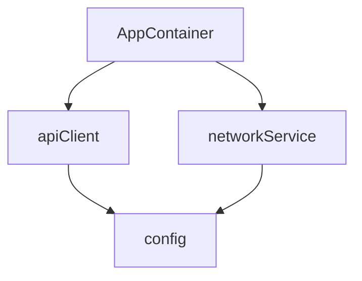

## Introduction

Since Swift 5.9, the macro system has significantly reduced boilerplate code. A well-known example is `@Observable`, which helps keep declarations concise.

However, dependency injection (DI) is still often handled either manually or with runtime-based libraries. Manual wiring becomes verbose, and runtime wiring can hide configuration issues until execution time.

**InnoDI** is a Swift Macro-based DI library designed to improve this experience. It diagnoses major setup issues at compile time and generates repetitive initialization code automatically.

## What InnoDI Solves

### Limits of common DI approaches

| Approach | Pros | Cons |
|------|------|------|
| Manual DI | Type-safe, explicit | Too much boilerplate |
| Runtime DI (e.g., Swinject) | Flexible | Setup issues may surface at runtime |
| Property Wrapper (`@Dependency`) | Convenient | Implicit dependencies can increase test complexity |

### InnoDI approach

```text
Compile-time diagnostics + automatic code generation + protocol-first design
```

1. **Compile-time diagnostics**: catches critical issues such as circular references and missing dependencies during build.
2. **Code generation**: macros generate init/factory wiring automatically.
3. **Protocol-first design**: encourages DIP-oriented architecture and easier testing.

---

## Core Concepts

### 1. `@DIContainer`

Macro for declaring a struct as a DI container.

```swift
@DIContainer
struct AppContainer {
    // dependency declarations
}
```

#### Options

| Parameter | Default | Description |
|----------|--------|------|
| `validate` | `true` | Enables compile-time validation |
| `root` | `false` | Marks root container in CLI graph output |
| `validateDAG` | `true` | Participates in DAG cycle validation |
| `mainActor` | `false` | Applies `@MainActor` isolation |

### 2. `@Provide`

Macro used to register dependencies.

```swift
@Provide(
    _ scope: DIScope = .shared,
    _ type: Any.Type? = nil,
    with dependencies: [AnyKeyPath] = [],
    factory: Any? = nil,
    asyncFactory: Any? = nil,
    concrete: Bool = false
)
```

### 3. `DIScope` - lifecycle of dependencies

```swift
public enum DIScope {
    case shared     // created once per container and reused
    case input      // must be injected from outside when container is created
    case transient  // new instance every access
}
```

---

## Usage

### Basic setup

#### 1. Add package in `Package.swift`

```swift
dependencies: [
    .package(url: "https://github.com/InnoSquadCorp/InnoDI.git", from: "2.0.0")
]
```

#### 2. Add product dependency to target

```swift
.target(
    name: "YourApp",
    dependencies: [
        .product(name: "InnoDI", package: "InnoDI")
    ]
)
```

### Register dependencies

#### `.input` - external dependencies

Values that must be decided at app startup.

```swift
@DIContainer
struct AppContainer {
    @Provide(.input)
    var baseURL: String

    @Provide(.input)
    var apiKey: String
}

let container = AppContainer(
    baseURL: "https://api.example.com",
    apiKey: "your-api-key"
)
```

#### `.shared` - shared per container

Created once per container lifecycle.

```swift
protocol NetworkServiceProtocol {
    func request(_ endpoint: String) async throws -> Data
}

struct NetworkService: NetworkServiceProtocol {
    let baseURL: String
    let session: URLSession

    func request(_ endpoint: String) async throws -> Data {
        // implementation
    }
}

@DIContainer
struct AppContainer {
    @Provide(.input)
    var baseURL: String

    @Provide(.shared, factory: { (baseURL: String) in
        NetworkService(baseURL: baseURL, session: .shared)
    })
    var networkService: any NetworkServiceProtocol
}
```

#### `.transient` - always a new instance

Best for objects like ViewModels that should hold fresh state.

```swift
@DIContainer
struct AppContainer {
    @Provide(.input)
    var networkService: any NetworkServiceProtocol

    @Provide(.transient, factory: { (network: any NetworkServiceProtocol) in
        HomeViewModel(networkService: network)
    }, concrete: true)
    var homeViewModel: HomeViewModel
}

let vm1 = container.homeViewModel
let vm2 = container.homeViewModel
```

### AutoWiring

Wire dependencies of dependencies automatically.

```swift
@DIContainer
struct AppContainer {
    @Provide(.input)
    var config: AppConfig

    @Provide(.input)
    var logger: Logger

    @Provide(.shared, APIClient.self, with: [\.config, \.logger])
    var apiClient: any APIClientProtocol
}
```

Conceptually, macro-generated code looks like this:

```swift
init(config: AppConfig, logger: Logger) {
    self.config = config
    self.logger = logger
    self._apiClient = APIClient(config: config, logger: logger)
}
```

### Async factory

If async initialization is required, use `asyncFactory`.

```swift
@Provide(.shared, asyncFactory: { (config: AppConfig) async throws in
    try await DatabaseService.connect(config: config)
})
var database: any DatabaseServiceProtocol
```

---

## Testing

### Inject mocks with init override

One of InnoDI's key strengths is **constructor override**.

```swift
@DIContainer
struct AppContainer {
    @Provide(.input)
    var baseURL: String

    @Provide(.shared, factory: { (url: String) in
        APIClient(baseURL: url)
    })
    var apiClient: any APIClientProtocol
}

let container = AppContainer(baseURL: "https://api.example.com")

let testContainer = AppContainer(
    baseURL: "https://test.example.com",
    apiClient: MockAPIClient()
)
```

You can pass test doubles directly without maintaining a separate `Overrides` struct.

---

## Compile-Time Validation

### Detect circular dependencies

```swift
@DIContainer
struct AppContainer {
    @Provide(.shared, factory: ServiceA(serviceB: serviceB), concrete: true)
    var serviceA: ServiceA

    @Provide(.shared, factory: ServiceB(serviceA: serviceA), concrete: true)
    var serviceB: ServiceB  // ❌ compile error
}
// Error: "Dependency cycle detected: serviceA -> serviceB -> serviceA"
```

### Protocol-first guidance (DIP-oriented)

```swift
// ❌ explicit opt-in required for concrete type
@Provide(.shared, factory: APIClient())
var apiClient: APIClient

// ✅ use protocol type
@Provide(.shared, factory: APIClient())
var apiClient: any APIClientProtocol

// ✅ use concrete when needed
@Provide(.shared, concrete: true, factory: APIClient())
var apiClient: APIClient
```

### Validation scope

With default settings (`validate: true`), major configuration issues are diagnosed at compile time. If you relax this with `validate: false`, some missing-wiring cases may fall back to runtime `fatalError`.

---

## Visualize Dependency Graphs

InnoDI provides a CLI tool to visualize dependency graphs.

### Mermaid output

```bash
swift run InnoDI-DependencyGraph --root /path/to/project
```



### Graphviz DOT output

```bash
swift run InnoDI-DependencyGraph --root /path/to/project --format dot --output graph.dot
```

### DAG validation

```bash
swift run InnoDI-DependencyGraph --root /path/to/project --validate-dag
```

### Build tool plugin

You can validate automatically during builds by adding a plugin in `Package.swift`.

```swift
.target(
    name: "YourApp",
    dependencies: ["InnoDI"],
    plugins: [
        .plugin(name: "InnoDIDAGValidationPlugin", package: "InnoDI")
    ]
)
```

---

## Real Architecture Example

### Using with clean architecture

```swift
protocol WeatherRepository {
    func fetchWeather(city: String) async throws -> Weather
}

struct WeatherRepositoryImpl: WeatherRepository {
    let apiClient: any APIClientProtocol
    let cache: any CacheProtocol

    func fetchWeather(city: String) async throws -> Weather {
        // implementation
    }
}

@MainActor
@Observable
class WeatherViewModel {
    let repository: any WeatherRepository

    init(repository: any WeatherRepository) {
        self.repository = repository
    }
}

@DIContainer(mainActor: true)
struct AppContainer {
    @Provide(.input)
    var baseURL: String

    @Provide(.shared, APIClient.self, with: [\.baseURL])
    var apiClient: any APIClientProtocol

    @Provide(.shared, factory: { MemoryCache() })
    var cache: any CacheProtocol

    @Provide(.shared, WeatherRepositoryImpl.self, with: [\.apiClient, \.cache])
    var weatherRepository: any WeatherRepository

    @Provide(.transient, WeatherViewModel.self, with: [\.weatherRepository], concrete: true)
    var weatherViewModel: WeatherViewModel
}

@main
struct WeatherApp: App {
    let container = AppContainer(baseURL: "https://api.weather.com")

    var body: some Scene {
        WindowGroup {
            WeatherView(viewModel: container.weatherViewModel)
        }
    }
}
```

---

## Comparison with alternatives

| Feature | InnoDI | Swinject | Factory | Manual |
|------|--------|----------|---------|------|
| Compile-time validation | Strong | Weak | Partial | Strong (if done carefully) |
| Cycle detection | Supported | Limited | Limited | Manual checks required |
| Boilerplate | Low | Medium | Low | High |
| Runtime misconfiguration risk | Low (with defaults) | Present | Low | Low |
| Learning curve | Low to medium | Medium | Low | None |
| SwiftUI integration | Easy | Easy | Easy | Easy |

---

## Conclusion

InnoDI is a library that improves both DI quality and developer experience by leveraging Swift macros.

### Recommended for

- Projects adopting **clean architecture**
- Teams that care about **testability**
- Teams that want to reduce **runtime wiring errors**
- Developers who want to remove repetitive **boilerplate**

### Key benefits

1. **Compile-time diagnostics** for major setup issues.
2. **Automatic code generation** for repetitive initialization.
3. **Protocol-first design** aligned with testable architecture.
4. **Simple mock injection** via init override.
5. **Dependency graph visualization** for faster architecture understanding.

---

## References

- [InnoDI GitHub Repository](https://github.com/InnoSquadCorp/InnoDI)
- [Swift Macro Documentation](https://docs.swift.org/swift-book/documentation/the-swift-programming-language/macros/)
- [Dependency Inversion Principle (DIP)](https://en.wikipedia.org/wiki/Dependency_inversion_principle)
