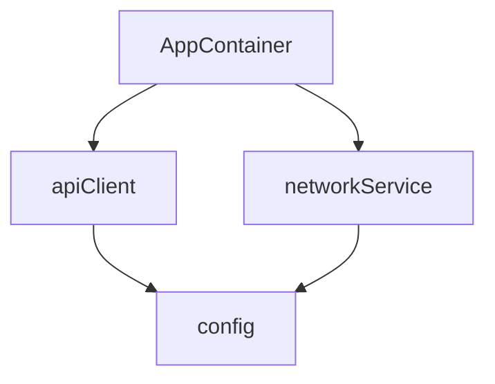

## 들어가며

Swift 5.9부터 도입된 Macro 시스템은 Swift 코드의 보일러플레이트를 줄이는 데 큰 역할을 하고 있습니다. `@Observable`처럼 선언을 간결하게 만들어 주는 기능이 대표적입니다.

하지만 **의존성 주입(Dependency Injection)** 영역에서는 여전히 수동으로 코드를 작성하거나, 런타임 기반 라이브러리에 의존하는 경우가 많습니다. 수동 구성은 장황해지기 쉽고, 런타임 기반 방식은 설정 실수가 실행 중 문제로 드러날 수 있습니다.

**InnoDI**는 이 지점을 개선하기 위해 만들어진 Swift Macro 기반 DI 라이브러리입니다. 주요 설정 오류를 컴파일 타임에 진단하고, 반복적인 초기화 코드를 자동 생성해 개발 경험을 개선합니다.

## InnoDI가 해결하는 문제

### 기존 DI 방식의 한계

| 방식 | 장점 | 단점 |
|------|------|------|
| 수동 의존성 주입 | 타입 안전, 명시적 | 보일러플레이트 과다 |
| 런타임 DI (Swinject 등) | 유연함 | 설정 오류가 런타임에 드러날 수 있음 |
| Property Wrapper (@Dependency) | 간편함 | 암시적 의존성, 테스트 복잡도 증가 가능 |

### InnoDI의 접근법

```
컴파일 타임 진단 + 자동 코드 생성 + 프로토콜 우선 설계
```

1. **컴파일 타임 진단**: 순환 참조, 누락된 의존성 같은 주요 설정 오류를 빌드 시점에 확인합니다.
2. **자동 코드 생성**: init 및 팩토리 연결 코드를 매크로가 자동으로 생성합니다.
3. **프로토콜 우선**: DIP(의존성 역전 원칙) 지향 설계를 통해 테스트 용이성을 높입니다.

---

## 핵심 개념

### 1. `@DIContainer`

DI 컨테이너로 사용할 struct를 선언하는 매크로입니다.

```swift
@DIContainer
struct AppContainer {
    // 의존성 선언
}
```

#### 옵션

| 파라미터 | 기본값 | 설명 |
|----------|--------|------|
| `validate` | `true` | 컴파일 타임 검증 활성화 |
| `root` | `false` | CLI 그래프에서 루트 컨테이너 표시 |
| `validateDAG` | `true` | DAG 순환 참조 검증 참여 여부 |
| `mainActor` | `false` | `@MainActor` 격리 적용 |

### 2. `@Provide`

의존성을 선언하는 매크로입니다.

```swift
@Provide(
    _ scope: DIScope = .shared,
    _ type: Any.Type? = nil,
    with dependencies: [AnyKeyPath] = [],
    factory: Any? = nil,
    asyncFactory: Any? = nil,
    concrete: Bool = false
)
```

### 3. `DIScope` - 의존성 생명주기

```swift
public enum DIScope {
    case shared     // 컨테이너당 1회 생성 후 재사용
    case input      // 컨테이너 생성 시 외부에서 주입 필수
    case transient  // 접근할 때마다 새 인스턴스 생성
}
```

---

## 사용법

### 기본 설정

#### 1. Package.swift 추가

```swift
dependencies: [
    .package(url: "https://github.com/InnoSquadCorp/InnoDI.git", from: "2.0.0")
]
```

#### 2. 타겟에 의존성 추가

```swift
.target(
    name: "YourApp",
    dependencies: [
        .product(name: "InnoDI", package: "InnoDI")
    ]
)
```

### 의존성 등록하기

#### `.input` - 외부 의존성

앱 실행 시점에 결정되어야 하는 값들입니다.

```swift
@DIContainer
struct AppContainer {
    @Provide(.input)
    var baseURL: String

    @Provide(.input)
    var apiKey: String
}

// 사용
let container = AppContainer(
    baseURL: "https://api.example.com",
    apiKey: "your-api-key"
)
```

#### `.shared` - 컨테이너 단위 공유 인스턴스

컨테이너 수명 동안 한 번만 생성됩니다.

```swift
protocol NetworkServiceProtocol {
    func request(_ endpoint: String) async throws -> Data
}

struct NetworkService: NetworkServiceProtocol {
    let baseURL: String
    let session: URLSession

    func request(_ endpoint: String) async throws -> Data {
        // 구현
    }
}

@DIContainer
struct AppContainer {
    @Provide(.input)
    var baseURL: String

    @Provide(.shared, factory: { (baseURL: String) in
        NetworkService(baseURL: baseURL, session: .shared)
    })
    var networkService: any NetworkServiceProtocol
}
```

#### `.transient` - 매번 새 인스턴스

주로 ViewModel처럼 매번 새로운 상태가 필요한 객체에 사용합니다.

```swift
@DIContainer
struct AppContainer {
    @Provide(.input)
    var networkService: any NetworkServiceProtocol

    @Provide(.transient, factory: { (network: any NetworkServiceProtocol) in
        HomeViewModel(networkService: network)
    }, concrete: true)
    var homeViewModel: HomeViewModel
}

// 각 접근이 새 인스턴스 생성
let vm1 = container.homeViewModel  // 새 인스턴스
let vm2 = container.homeViewModel  // 또 다른 새 인스턴스
```

### AutoWiring

의존성의 의존성을 자동으로 연결합니다.

```swift
@DIContainer
struct AppContainer {
    @Provide(.input)
    var config: AppConfig

    @Provide(.input)
    var logger: Logger

    // APIClient는 config와 logger가 필요
    // AutoWiring이 자동으로 주입
    @Provide(.shared, APIClient.self, with: [\.config, \.logger])
    var apiClient: any APIClientProtocol
}
```

매크로는 개념적으로 아래와 같은 초기화를 생성합니다.

```swift
// 자동 생성된 코드 (개념적 예시)
init(config: AppConfig, logger: Logger) {
    self.config = config
    self.logger = logger
    self._apiClient = APIClient(config: config, logger: logger)
}
```

### 비동기 팩토리

비동기 초기화가 필요한 경우에는 `asyncFactory`를 사용합니다.

```swift
@Provide(.shared, asyncFactory: { (config: AppConfig) async throws in
    try await DatabaseService.connect(config: config)
})
var database: any DatabaseServiceProtocol
```

---

## 테스트하기

### Init Override로 Mock 주입

InnoDI의 핵심 장점 중 하나는 **생성자 오버라이드**입니다.

```swift
// 프로덕션 코드
@DIContainer
struct AppContainer {
    @Provide(.input)
    var baseURL: String

    @Provide(.shared, factory: { (url: String) in
        APIClient(baseURL: url)
    })
    var apiClient: any APIClientProtocol
}

// 프로덕션 사용
let container = AppContainer(baseURL: "https://api.example.com")
// container.apiClient -> 실제 APIClient 인스턴스

// 테스트 사용 - Mock으로 오버라이드
let testContainer = AppContainer(
    baseURL: "https://test.example.com",
    apiClient: MockAPIClient()
)
// testContainer.apiClient -> MockAPIClient 인스턴스
```

별도의 `Overrides` 구조체 없이, 생성자에 Mock을 직접 전달하실 수 있습니다.

---

## 컴파일 타임 검증

### 순환 의존성 탐지

```swift
@DIContainer
struct AppContainer {
    @Provide(.shared, factory: ServiceA(serviceB: serviceB), concrete: true)
    var serviceA: ServiceA

    @Provide(.shared, factory: ServiceB(serviceA: serviceA), concrete: true)
    var serviceB: ServiceB  // ❌ 컴파일 에러
}
// Error: "Dependency cycle detected: serviceA -> serviceB -> serviceA"
```

### 프로토콜 타입 우선 (DIP 지향)

구체 타입 대신 프로토콜 사용을 기본으로 유도합니다.

```swift
// ❌ 구체 타입은 명시적 opt-in 필요
@Provide(.shared, factory: APIClient())
var apiClient: APIClient  // Error

// ✅ 프로토콜 타입 사용
@Provide(.shared, factory: APIClient())
var apiClient: any APIClientProtocol  // OK

// ✅ 구체 타입을 사용해야 한다면
@Provide(.shared, concrete: true, factory: APIClient())
var apiClient: APIClient  // OK
```

### 검증 범위 참고

기본 설정(`validate: true`)에서는 누락된 팩토리 등 주요 설정 문제가 컴파일 타임에 진단됩니다.  
다만 `validate: false`로 완화하면 일부 누락 케이스는 런타임 `fatalError` fallback으로 처리될 수 있으므로, 보통은 기본값 사용을 권장드립니다.

---

## 의존성 그래프 시각화

InnoDI는 CLI 도구를 제공하여 의존성 그래프를 시각화할 수 있습니다.

### Mermaid 다이어그램 생성

```bash
swift run InnoDI-DependencyGraph --root /path/to/project
```



### Graphviz DOT 형식

```bash
swift run InnoDI-DependencyGraph --root /path/to/project --format dot --output graph.dot
```

### DAG 검증

```bash
swift run InnoDI-DependencyGraph --root /path/to/project --validate-dag
```

### Build Tool Plugin

`Package.swift`에 플러그인을 추가하시면 빌드 시 자동 검증을 수행하실 수 있습니다.

```swift
.target(
    name: "YourApp",
    dependencies: ["InnoDI"],
    plugins: [
        .plugin(name: "InnoDIDAGValidationPlugin", package: "InnoDI")
    ]
)
```

---

## 실제 아키텍처 예시

### 클린 아키텍처와 함께 사용하기

```swift
// Domain Layer
protocol WeatherRepository {
    func fetchWeather(city: String) async throws -> Weather
}

// Data Layer
struct WeatherRepositoryImpl: WeatherRepository {
    let apiClient: any APIClientProtocol
    let cache: any CacheProtocol

    func fetchWeather(city: String) async throws -> Weather {
        // 구현
    }
}

// Presentation Layer
@MainActor
@Observable
class WeatherViewModel {
    let repository: any WeatherRepository

    init(repository: any WeatherRepository) {
        self.repository = repository
    }
}

// DI Container
@DIContainer(mainActor: true)
struct AppContainer {
    // Configuration
    @Provide(.input)
    var baseURL: String

    // Data Layer
    @Provide(.shared, APIClient.self, with: [\.baseURL])
    var apiClient: any APIClientProtocol

    @Provide(.shared, factory: { MemoryCache() })
    var cache: any CacheProtocol

    // Repository
    @Provide(.shared, WeatherRepositoryImpl.self, with: [\.apiClient, \.cache])
    var weatherRepository: any WeatherRepository

    // ViewModels (transient - 매번 새 인스턴스)
    @Provide(.transient, WeatherViewModel.self, with: [\.weatherRepository], concrete: true)
    var weatherViewModel: WeatherViewModel
}

// App 진입점
@main
struct WeatherApp: App {
    let container = AppContainer(baseURL: "https://api.weather.com")

    var body: some Scene {
        WindowGroup {
            WeatherView(viewModel: container.weatherViewModel)
        }
    }
}
```

---

## 다른 라이브러리와 비교

| 기능 | InnoDI | Swinject | Factory | 수동 |
|------|--------|----------|---------|------|
| 컴파일 타임 검증 | 강함 | 약함 | 일부 | 강함(직접 작성 시) |
| 순환 참조 탐지 | 지원 | 제한적 | 제한적 | 수동 점검 필요 |
| 보일러플레이트 | 적음 | 중간 | 적음 | 많음 |
| 런타임 설정 오류 가능성 | 낮음(기본 설정 기준) | 있음 | 낮음 | 낮음 |
| 학습 곡선 | 낮음~중간 | 중간 | 낮음 | 없음 |
| SwiftUI 통합 | 용이 | 용이 | 용이 | 용이 |

---

## 결론

InnoDI는 **Swift Macro를 활용해 DI 설정 품질과 개발자 경험을 함께 개선하는 라이브러리**입니다.

### 추천 대상

- **클린 아키텍처**를 도입하는 프로젝트
- **테스트 용이성**이 중요한 프로젝트
- **런타임 설정 오류**를 줄이고 싶은 팀
- **보일러플레이트**를 줄이고 싶은 개발자

### InnoDI의 장점 요약

1. **컴파일 타임 진단** - 주요 설정 오류를 조기에 확인할 수 있습니다.
2. **자동 코드 생성** - 반복되는 초기화 코드를 줄일 수 있습니다.
3. **프로토콜 우선 설계** - 테스트 가능한 구조를 유지하기 좋습니다.
4. **간편한 Mock 주입** - Init Override로 테스트 코드를 단순화할 수 있습니다.
5. **의존성 그래프 시각화** - 아키텍처 관계를 빠르게 파악할 수 있습니다.

---

## 참고 자료

- [InnoDI GitHub 저장소](https://github.com/InnoSquadCorp/InnoDI)
- [Swift Macro 공식 문서](https://docs.swift.org/swift-book/documentation/the-swift-programming-language/macros/)
- [의존성 역전 원칙 (DIP)](https://en.wikipedia.org/wiki/Dependency_inversion_principle)
