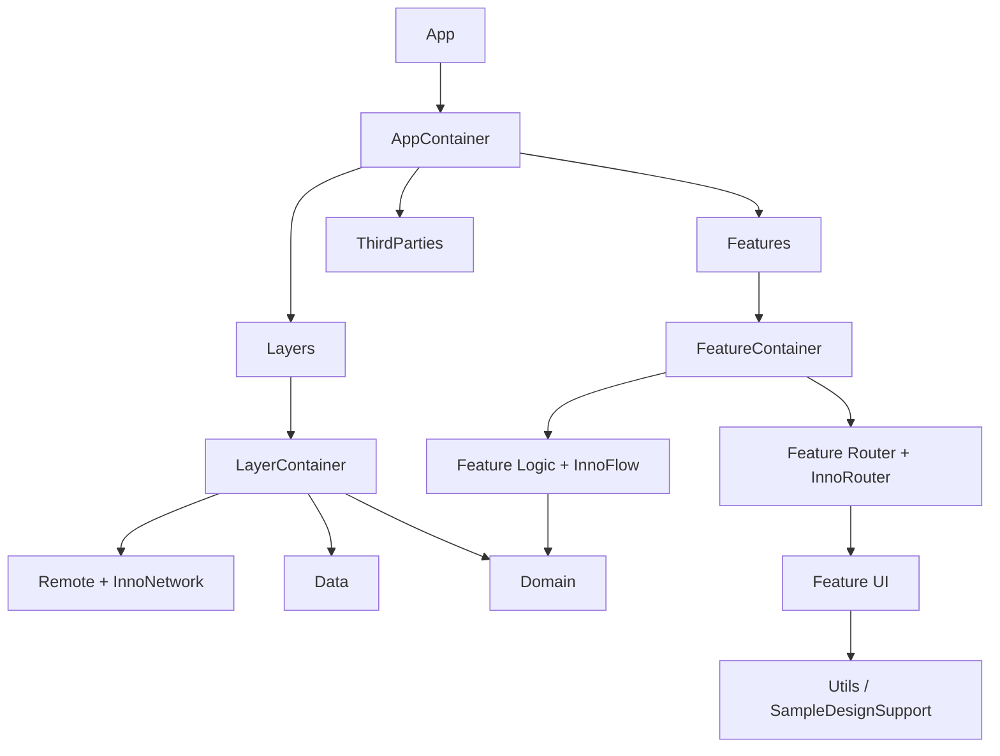

## The core idea

[`InnoDI`](https://github.com/InnoSquadCorp/InnoDI), [`InnoFlow`](https://github.com/InnoSquadCorp/InnoFlow), [`InnoRouter`](https://github.com/InnoSquadCorp/InnoRouter), and [`InnoNetwork`](https://github.com/InnoSquadCorp/InnoNetwork) are useful on their own. In a real iOS app, though, the more important question is not only how to call each API.

**Which boundary should each library own so they do not step on each other?**

[`InnoSample`](https://github.com/InnoSquadCorp/InnoSample) exists to answer that question. It is not a feature-heavy sample app. It is a baseline scaffold for the boundaries real apps need early: composition, state, navigation, and networking.

The individual best-practice posts go deeper on each library:

- [InnoDI Best Practices: Using Swift Macro DI to Preserve App Structure]()
- [InnoFlow Best Practices: Managing SwiftUI Feature Logic with One-Way State]()
- [InnoRouter Best Practices: Managing SwiftUI Navigation with Routes and Coordinators]()
- [InnoNetwork Best Practices: Designing Swift Concurrency Networking Boundaries]()
- [Understanding Modularity]()
- [Clean Architecture]()

This post focuses on what happens when the four libraries are placed together.

## The versions used by InnoSample

`Tuist/Package.swift` pins the Inno packages as remote dependencies.

```swift
dependencies: [
    .package(url: "https://github.com/InnoSquadCorp/InnoDI.git", exact: "4.3.0"),
    .package(url: "https://github.com/InnoSquadCorp/InnoFlow", exact: "4.0.0"),
    .package(url: "https://github.com/InnoSquadCorp/InnoNetwork.git", exact: "4.0.0"),
    .package(url: "https://github.com/InnoSquadCorp/InnoRouter.git", exact: "4.2.1"),
]
```

The sample does not let every feature import every library freely. Each library sits where its responsibility fits.

- `InnoDI`: `AppContainer`, `LayerContainer`, `FeatureContainer`
- `InnoFlow`: feature `Logic`
- `InnoRouter`: feature `Router`
- `InnoNetwork`: `Remote`
- `Utils`: shared `SampleDesignSupport` for feature UI

That placement is the whole point.

## The app shape

The main dependency direction is:

- `Feature -> Domain`
- `Data -> Domain`
- `Remote -> Data + InnoNetwork`
- `Layers -> Domain + Data + Remote`
- `Features -> Domain + Feature`
- `App -> Layers + Features + ThirdParties`
- `Feature UI -> Utils`



`Layers` and `Features` are not just folders. They are composition boundaries. `Utils` separates cross-cutting UI support such as shared design helpers without turning it into business state. The point is to hide implementation detail and expose only the next useful surface.

## 1. InnoDI fixes construction boundaries

InnoDI is not used as a global dependency access mechanism. In InnoSample, it appears strongly at composition roots and container boundaries.

```swift
@MainActor
@DIContainer(root: true, mainActor: true)
struct AppContainer {
    @Provide(.input)
    var baseURL: URL

    @Provide(.shared, factory: { (baseURL: URL) in
        LayerContainer(baseURL: baseURL)
    }, concrete: true)
    var layerContainer: LayerContainer

    @Provide(.shared, factory: { (layerContainer: LayerContainer) in
        layerContainer.featureUseCases
    })
    var featureUseCases: any FeatureUseCaseContaining

    @SubContainer(
        scope: .shared,
        bindings: [(child: \FeatureContainer.useCases, parent: \AppContainer.featureUseCases)],
        featureRoot: FeatureRootScene.self
    )
    var featureContainer: FeatureContainer
}
```

`AppContainer` fixes the creation order for the app. It does not know every remote data source or every leaf coordinator detail.

This gives the app:

- a visible startup graph
- explicit container ownership
- generated SwiftUI root-scene wiring
- less DI framework exposure inside feature logic

In the combined architecture, InnoDI answers: "who creates whom?"

## 2. InnoNetwork keeps external API policy inside Remote

Network code spreads quickly when features call clients directly. InnoSample keeps InnoNetwork inside `Remote`.

```swift
@DIContainer
public struct RemoteContainer {
    @Provide(.input)
    public var baseURL: URL

    @Provide(.shared, factory: { (baseURL: URL) in
        RemoteClientFactory.makeClient(baseURL: baseURL)
    })
    var networkClient: any NetworkClient

    @Provide(.shared, factory: { (networkClient: any NetworkClient) in
        UserRemoteFactory.make(networkClient: networkClient)
    })
    public var userRemoteDataSource: any UserRemoteDataSourceProtocol
}
```

`RemoteClientFactory` owns operational policy such as retry, interceptors, and timeout.

```swift
let configuration = NetworkConfiguration.advanced(
    baseURL: environment.baseURL,
    resilience: ResiliencePack(
        retry: ExponentialBackoffRetryPolicy(maxRetries: 2)
    ),
    auth: AuthPack(
        additionalSigners: [RemoteMetadataInterceptor(environment: environment)],
        additionalResponseInterceptors: [RemoteStatusInterceptor()]
    ),
    transport: TransportPack(timeout: 20.0)
)
```

Features do not know HTTP. `Domain` does not know `NetworkClient`. External API execution finishes inside `Remote`, and `Data` sees only remote data source contracts.

In the combined architecture, InnoNetwork answers: "how do we communicate with the outside world?"

## 3. Data and Domain translate transport into app language

`Remote` performs API calls, `Data` owns repository implementations and remote data source contracts, and `Domain` exposes entities, repository protocols, and use cases.

The layers keep their jobs separate:

- `Remote`: API requests, DTOs, failure mapping
- `Data`: repository implementation and DTO-to-domain mapping
- `Domain`: use cases, domain models, repository protocols
- `Feature`: use case calls

Use cases are concrete action objects that features can call. Repositories remain protocols because they are real layer-boundary contracts.

This keeps feature code in app language: "load people", "load posts", "load todos", not "perform this HTTP request".

## 4. InnoFlow controls feature state transitions

Feature `Logic` targets use InnoFlow. `PeopleFeatureReducer` manages loading, loaded, failed, selected user, and settings-navigation intent in one reducer.

```swift
@InnoFlow(phaseManaged: true)
struct PeopleFeatureReducer {
    struct Dependencies: Sendable {
        let loadPeople: @Sendable () async throws -> [UserSummary]
    }

    struct State: Equatable, Sendable, DefaultInitializable {
        enum Phase: Hashable, Sendable {
            case idle
            case loading
            case loaded
            case failed
        }

        var phase: Phase = .idle
        var people: [UserSummary] = []
        var errorMessage: String?
        var pendingSettingsRequest: PeopleSettingsRequest?
    }
}
```

The reducer does not know `NetworkClient` or `NavigationStore`.

- Network work hides behind a use case closure.
- Navigation is expressed as pending intent.
- UI renders state and sends actions.

In the combined architecture, InnoFlow answers: "how does this feature state change?"

## 5. InnoRouter turns screen movement into data

Feature `Router` targets use InnoRouter. Leaf features know their own routes; sibling movement is mediated by `EntireTabCoordinator`.

```swift
public final class EntireTabCoordinator: TabCoordinator {
    let peopleCoordinator: PeopleFeatureCoordinator
    let postsCoordinator: PostsFeatureCoordinator
    let settingsCoordinator: SettingsFeatureCoordinator

    func syncCrossFeatureNavigationFromPeople() {
        guard let request = peopleCoordinator.consumeSettingsRequest() else { return }
        selectedTab = .settings
        settingsCoordinator.showDetail(assigneeID: request.assigneeID)
    }
}
```

This creates a useful separation:

- `PeopleFeature` does not import `SettingsFeature`.
- Runtime movement from People to Settings is still possible.
- Compile-time dependency stays `People -> EntireTab <- Settings`.
- InnoFlow creates navigation intent; InnoRouter executes it.

In the combined architecture, InnoRouter answers: "how should this movement be modeled and executed?"

## The synergy

Putting four libraries in one app does not automatically create good architecture. The benefit comes from giving each library a different boundary.

InnoSample's split is:

| Responsibility | Owner |
| --- | --- |
| Construction and ownership | InnoDI |
| External API execution policy | InnoNetwork |
| App data transformation and use cases | Data / Domain |
| Feature state transitions | InnoFlow |
| Screen movement execution | InnoRouter |
| Shared UI support | Utils |
| Top-level composition | App / Layers / Features |

The result:

- the DI graph does not become a state machine
- reducers do not mutate navigation stacks directly
- network clients do not leak into features
- routers do not own business logic
- app root does not construct every leaf implementation directly

The larger value is not using each library in isolation. It is **placing them so they do not invade each other's jobs.**

## Principles to reuse in your app

You do not need to copy InnoSample exactly. The reusable principles are:

1. `App` owns root composition only.
2. `Layers` wires `Remote/Data/Domain` and exposes feature-facing use cases.
3. `Features` wires leaf feature inputs and routers.
4. Leaf features are split into `Interface / Logic / UI / Router / Testing`.
5. `Utils` holds stateless shared UI support such as design helpers.
6. Cross-feature navigation is mediated by a parent coordinator.
7. Network policy stays inside `Remote`.
8. Reducers call use cases, not clients or containers.

Those rules keep files honest as the app grows.

## Conclusion

InnoSample is not just a showcase for four libraries. It is an example of placing four libraries at four different architecture boundaries.

- InnoDI fixes construction boundaries.
- InnoNetwork isolates external API execution.
- InnoFlow controls feature state transitions.
- InnoRouter executes navigation through typed routes and coordinators.

The appeal is not that the stack has many features. The appeal is that it separates the responsibilities that usually become tangled in real apps: construction, state, navigation, and networking.

When reading InnoSample, the best question is not "how do I call this API?"

The better question is:

**Can my app split these responsibilities the same way?**

If the answer is yes, the Inno libraries become more than a tool collection. They become a practical starting point for preserving app structure over time.
