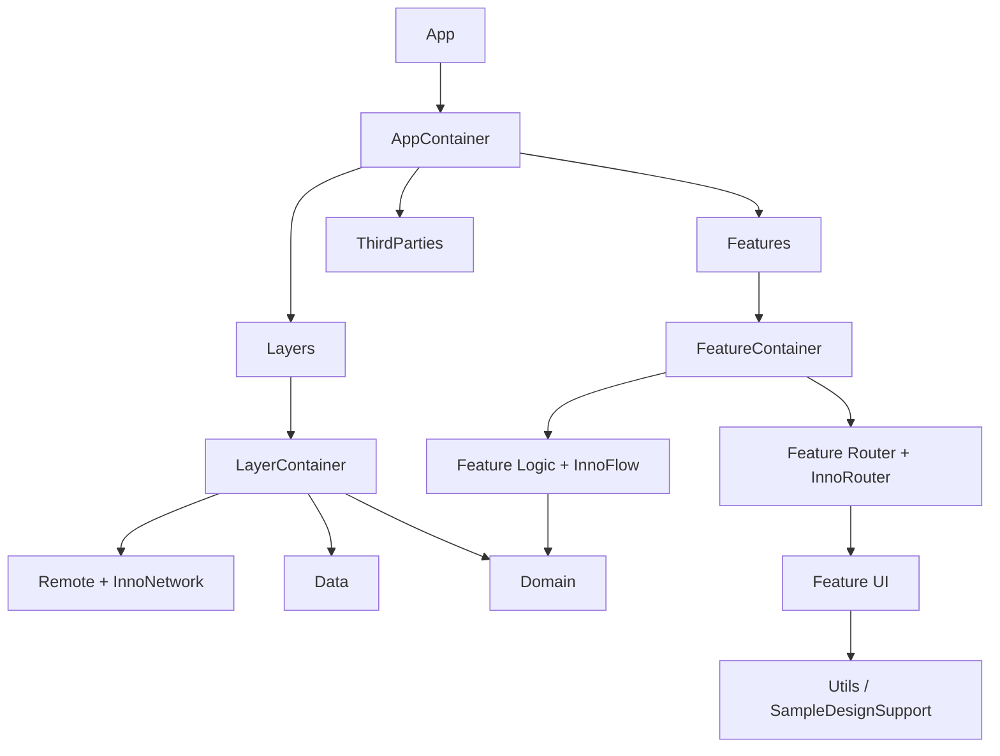

## 이 글의 핵심

[`InnoDI`](https://github.com/InnoSquadCorp/InnoDI), [`InnoFlow`](https://github.com/InnoSquadCorp/InnoFlow), [`InnoRouter`](https://github.com/InnoSquadCorp/InnoRouter), [`InnoNetwork`](https://github.com/InnoSquadCorp/InnoNetwork)는 각각 따로 써도 가치가 있습니다. 하지만 실제 iOS 앱에서는 "각 라이브러리를 잘 쓰는 법"보다 더 중요한 질문이 있습니다.

**각 라이브러리가 어떤 경계를 소유해야 서로 침범하지 않는가?**

[`InnoSample`](https://github.com/InnoSquadCorp/InnoSample)은 이 질문에 답하기 위한 샘플입니다. 기능을 많이 보여주는 데 목적이 있지 않습니다. 실제 앱을 시작할 때 먼저 고정해야 하는 경계, composition, state, navigation, networking의 배치를 보여주는 baseline scaffold입니다.

개별 라이브러리의 best practice는 아래 글에서 더 자세히 다룹니다.

- [InnoDI Best Practice: Swift Macro DI를 앱 구조로 고정하는 법]()
- [InnoFlow Best Practice: SwiftUI Feature Logic을 단방향으로 관리하기]()
- [InnoRouter Best Practice: SwiftUI Navigation을 Route와 Coordinator로 다루기]()
- [InnoNetwork Best Practice: Swift Concurrency 네트워크 경계를 설계하는 법]()
- [Understanding Modularity]()
- [Clean Architecture]()

이 글은 네 라이브러리를 함께 배치했을 때 생기는 시너지를 중심으로 봅니다.

## 현재 InnoSample이 쓰는 버전

`Tuist/Package.swift` 기준으로 InnoSample은 remote package를 exact version으로 고정합니다.

```swift
dependencies: [
    .package(url: "https://github.com/InnoSquadCorp/InnoDI.git", exact: "4.3.0"),
    .package(url: "https://github.com/InnoSquadCorp/InnoFlow", exact: "4.0.0"),
    .package(url: "https://github.com/InnoSquadCorp/InnoNetwork.git", exact: "4.0.0"),
    .package(url: "https://github.com/InnoSquadCorp/InnoRouter.git", exact: "4.2.1"),
]
```

샘플은 각 라이브러리를 feature가 마음대로 import하게 두지 않습니다. 역할이 맞는 모듈에만 배치합니다.

- `InnoDI`: `AppContainer`, `LayerContainer`, `FeatureContainer`
- `InnoFlow`: feature `Logic`
- `InnoRouter`: feature `Router`
- `InnoNetwork`: `Remote`
- `Utils`: feature UI가 공유하는 `SampleDesignSupport`

이 배치가 글 전체의 핵심입니다.

## 전체 구조

InnoSample의 큰 의존 방향은 아래와 같습니다.

- `Feature -> Domain`
- `Data -> Domain`
- `Remote -> Data + InnoNetwork`
- `Layers -> Domain + Data + Remote`
- `Features -> Domain + Feature`
- `App -> Layers + Features + ThirdParties`
- `Feature UI -> Utils`

Mermaid로 보면 다음과 같습니다.



이 구조에서 중요한 점은 `Layers`와 `Features`가 단순 폴더가 아니라 composition boundary라는 점입니다. `Utils`는 feature UI가 공유하는 디자인 지원처럼 cross-cutting하지만 business state를 갖지 않는 요소를 분리합니다. 내부 구현을 숨기고, 다음 경계가 필요한 surface만 노출하는 것이 핵심입니다.

## 1. InnoDI는 생성 경계를 고정합니다

InnoDI는 앱 어디서나 dependency를 꺼내는 도구가 아닙니다. InnoSample에서 InnoDI는 composition root와 container boundary에만 강하게 등장합니다.

```swift
@MainActor
@DIContainer(root: true, mainActor: true)
struct AppContainer {
    @Provide(.input)
    var baseURL: URL

    @Provide(.shared, factory: { (baseURL: URL) in
        LayerContainer(baseURL: baseURL)
    }, concrete: true)
    var layerContainer: LayerContainer

    @Provide(.shared, factory: { (layerContainer: LayerContainer) in
        layerContainer.featureUseCases
    })
    var featureUseCases: any FeatureUseCaseContaining

    @SubContainer(
        scope: .shared,
        bindings: [(child: \FeatureContainer.useCases, parent: \AppContainer.featureUseCases)],
        featureRoot: FeatureRootScene.self
    )
    var featureContainer: FeatureContainer
}
```

여기서 `AppContainer`는 앱 전체의 생성 순서를 고정합니다. 하지만 `RemoteContainer`의 세부 data source나 `PeopleFeatureCoordinator`의 내부 상태를 직접 알지는 않습니다.

좋은 점은 분명합니다.

- 앱 시작점에서 큰 graph가 보입니다.
- container 간 ownership이 명시됩니다.
- SwiftUI root scene 연결이 반복 코드 없이 됩니다.
- feature는 DI framework를 직접 알 필요가 줄어듭니다.

즉 InnoDI는 네 라이브러리 중 "누가 누구를 만들어 주는가"를 담당합니다.

## 2. InnoNetwork는 외부 API 실행 정책을 Remote에 가둡니다

네트워크 코드는 feature에 직접 들어가면 빠르게 퍼집니다. InnoSample은 `Remote`가 InnoNetwork를 소유하게 합니다.

```swift
@DIContainer
public struct RemoteContainer {
    @Provide(.input)
    public var baseURL: URL

    @Provide(.shared, factory: { (baseURL: URL) in
        RemoteClientFactory.makeClient(baseURL: baseURL)
    })
    var networkClient: any NetworkClient

    @Provide(.shared, factory: { (networkClient: any NetworkClient) in
        UserRemoteFactory.make(networkClient: networkClient)
    })
    public var userRemoteDataSource: any UserRemoteDataSourceProtocol
}
```

`RemoteClientFactory`는 retry, interceptor, timeout 같은 운영 정책을 한곳에서 조립합니다.

```swift
let configuration = NetworkConfiguration.advanced(
    baseURL: environment.baseURL,
    resilience: ResiliencePack(
        retry: ExponentialBackoffRetryPolicy(maxRetries: 2)
    ),
    auth: AuthPack(
        additionalSigners: [RemoteMetadataInterceptor(environment: environment)],
        additionalResponseInterceptors: [RemoteStatusInterceptor()]
    ),
    transport: TransportPack(timeout: 20.0)
)
```

이렇게 하면 `Feature`는 HTTP를 모릅니다. `Domain`도 `NetworkClient`를 모릅니다. 외부 API 호출 정책은 `Remote` 안에서 끝나고, `Data`는 remote data source contract만 봅니다.

즉 InnoNetwork는 네 라이브러리 중 "외부 세계와 어떻게 통신할 것인가"를 담당합니다.

## 3. Domain과 Data는 앱 언어로 변환합니다

InnoSample에서 `Remote`는 raw API 호출을 하고, `Data`는 repository 구현과 remote data source contract를 소유합니다. `Domain`은 entity, repository protocol, use case를 제공합니다.

이 계층을 유지해야 InnoNetwork의 장점이 feature까지 새지 않습니다.

- `Remote`: API request, DTO, failure mapping
- `Data`: repository implementation, DTO -> domain mapping
- `Domain`: use case, domain model, repository protocol
- `Feature`: use case 호출

use case는 feature가 호출하기 좋은 action object처럼 둡니다. repository는 layer boundary contract이므로 protocol로 유지합니다.

이 배치 덕분에 feature 입장에서는 API가 아니라 "사람 목록을 불러온다", "게시글 목록을 불러온다", "할 일 목록을 불러온다" 같은 앱 언어만 남습니다.

## 4. InnoFlow는 feature 상태 전이를 통제합니다

InnoSample의 feature `Logic` 타깃은 InnoFlow를 사용합니다. 예를 들어 `PeopleFeatureReducer`는 loading, loaded, failed, selected user, settings 이동 intent를 모두 reducer 안에서 다룹니다.

```swift
@InnoFlow(phaseManaged: true)
struct PeopleFeatureReducer {
    struct Dependencies: Sendable {
        let loadPeople: @Sendable () async throws -> [UserSummary]
    }

    struct State: Equatable, Sendable, DefaultInitializable {
        enum Phase: Hashable, Sendable {
            case idle
            case loading
            case loaded
            case failed
        }

        var phase: Phase = .idle
        var people: [UserSummary] = []
        var errorMessage: String?
        var pendingSettingsRequest: PeopleSettingsRequest?
    }
}
```

중요한 점은 reducer가 `NetworkClient`나 `NavigationStore`를 직접 모른다는 것입니다.

- network는 use case closure 뒤에 숨습니다.
- navigation은 pending intent로만 표현됩니다.
- UI는 state를 표시하고 action을 보냅니다.

즉 InnoFlow는 네 라이브러리 중 "feature가 어떤 상태로 변하는가"를 담당합니다.

## 5. InnoRouter는 화면 이동을 데이터화합니다

InnoSample의 feature `Router` 타깃은 InnoRouter를 사용합니다. leaf feature는 자기 route만 알고, sibling feature 이동은 상위 `EntireTabCoordinator`가 중재합니다.

```swift
public final class EntireTabCoordinator: TabCoordinator {
    let peopleCoordinator: PeopleFeatureCoordinator
    let postsCoordinator: PostsFeatureCoordinator
    let settingsCoordinator: SettingsFeatureCoordinator

    func syncCrossFeatureNavigationFromPeople() {
        guard let request = peopleCoordinator.consumeSettingsRequest() else { return }
        selectedTab = .settings
        settingsCoordinator.showDetail(assigneeID: request.assigneeID)
    }
}
```

이 구조의 시너지는 큽니다.

- `PeopleFeature`는 `SettingsFeature`를 직접 import하지 않습니다.
- 런타임에서는 `People -> Settings` 이동이 가능합니다.
- 컴파일 의존은 `People -> EntireTab <- Settings`로 유지됩니다.
- navigation intent는 InnoFlow에서 만들고, InnoRouter가 실행합니다.

즉 InnoRouter는 네 라이브러리 중 "화면 이동을 어떻게 모델링하고 실행할 것인가"를 담당합니다.

## 통합했을 때 생기는 시너지

네 라이브러리를 한 앱에 넣는다고 자동으로 좋은 구조가 되지는 않습니다. 중요한 것은 각자 맡는 경계를 다르게 두는 것입니다.

InnoSample의 조합은 이렇게 읽을 수 있습니다.

| 책임 | 담당 |
| --- | --- |
| 생성과 ownership | InnoDI |
| 외부 API 실행 정책 | InnoNetwork |
| 앱 데이터 변환과 use case | Data / Domain |
| feature 상태 전이 | InnoFlow |
| 화면 이동 실행 | InnoRouter |
| UI 공용 지원 | Utils |
| 최상위 조립 | App / Layers / Features |

이 조합의 결과는 다음과 같습니다.

- DI graph가 state machine이 되지 않습니다.
- reducer가 navigation stack을 직접 조작하지 않습니다.
- network client가 feature로 새지 않습니다.
- router가 business logic을 소유하지 않습니다.
- app root가 모든 leaf 구현을 직접 알지 않습니다.

각 라이브러리를 따로 잘 쓰는 것보다, **서로 침범하지 않게 배치하는 것**이 더 큰 가치입니다.

## 실제 앱으로 가져갈 때의 원칙

InnoSample 구조를 그대로 복사할 필요는 없습니다. 하지만 아래 원칙은 유지하는 편이 좋습니다.

1. `App`은 root composition만 담당합니다.
2. `Layers`는 `Remote/Data/Domain`을 조립하고 feature-facing use case surface만 노출합니다.
3. `Features`는 leaf feature router와 input을 조립합니다.
4. leaf feature는 `Interface / Logic / UI / Router / Testing`으로 나눕니다.
5. `Utils`는 feature UI가 공유하는 디자인 지원처럼 상태 없는 공용 요소만 둡니다.
6. cross-feature navigation은 leaf끼리 직접 연결하지 않고 상위 coordinator에서 중재합니다.
7. network policy는 `Remote` 안에 가둡니다.
8. feature reducer는 use case만 호출합니다.

이 원칙을 지키면 앱이 커져도 각 파일이 하는 일이 비교적 선명하게 남습니다.

## 결론

InnoSample은 네 라이브러리의 showcase가 아니라, 네 라이브러리를 **서로 다른 아키텍처 경계에 배치하는 예제**입니다.

- InnoDI는 생성 경계를 고정합니다.
- InnoNetwork는 외부 API 실행 정책을 격리합니다.
- InnoFlow는 feature state transition을 통제합니다.
- InnoRouter는 navigation을 typed route와 coordinator로 실행합니다.

이 조합의 매력은 "기능이 많다"가 아닙니다. 실무 앱에서 계속 문제가 되는 생성, 상태, 이동, 네트워크 책임을 서로 다른 레이어에 고정한다는 점입니다.

그래서 InnoSample을 볼 때 가장 중요한 질문은 "이 라이브러리 API를 어떻게 호출하지?"가 아닙니다. 더 좋은 질문은 이것입니다.

**내 앱에서도 이 책임 경계를 같은 방식으로 나눌 수 있을까?**

그 답이 yes라면, Inno 계열 라이브러리는 단순 도구 모음이 아니라 앱 구조를 오래 유지하기 위한 좋은 출발점이 됩니다.
